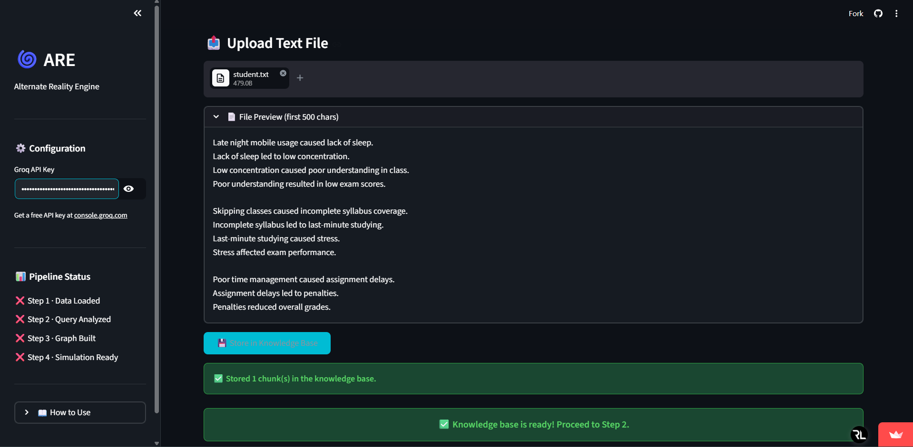
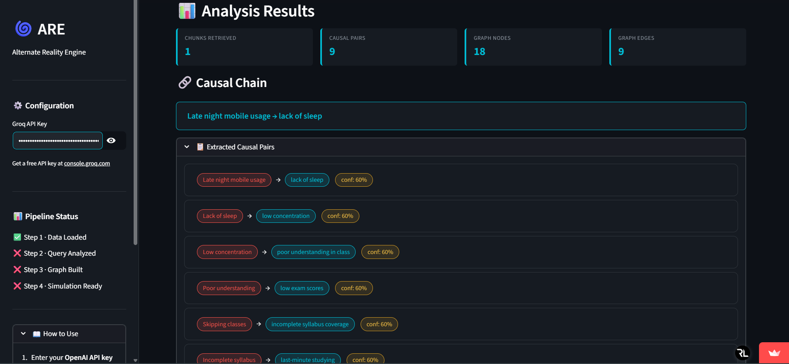
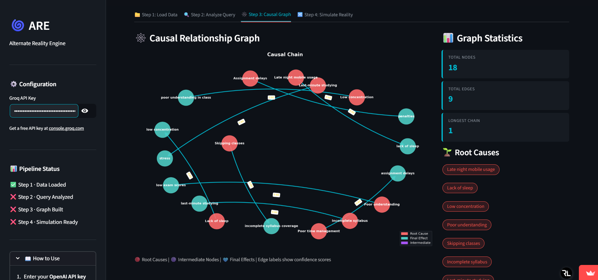
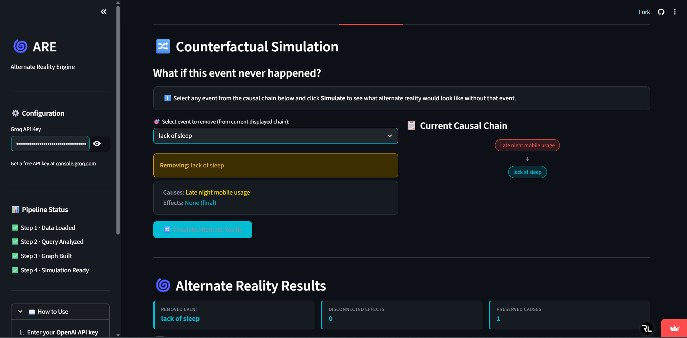
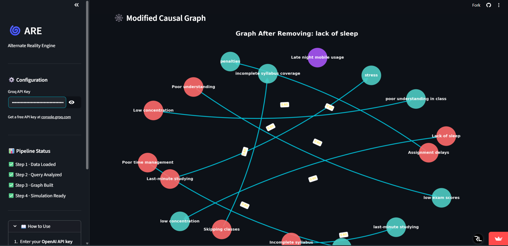

<h1 align="center"> 🌌 Alternate Reality Engine </h1>
<p align="center">
  <b>Causal RAG + Counterfactual Simulation Platform</b>
</p>


Alternate Reality Engine (ARE) is an AI-powered application that goes beyond traditional question answering by enabling **causal reasoning** and **“what-if” scenario simulation**. ARE focuses on understanding the **cause-and-effect relationships** behind events and integrates **Causal Retrieval-Augmented Generation (RAG)** with causal graph modeling to extract meaningful connections from data and represent them as structured knowledge. The system further enables counterfactual analysis, allowing users to explore alternate scenarios by modifying or removing events within the causal chain.


## 🚀 Features

- Upload and analyze domain-specific text data
- Extract cause-and-effect relationships automatically  
- Build structured causal graphs from retrieved context  
- Visualize event dependencies using graph representations  
- Simulate counterfactual scenarios ("what-if analysis")  
- Generate human-readable explanations of causal chains  
- Reduce hallucinations through structured reasoning  
- Enable explainable and interpretable AI outputs  


## 🌍 Deployment

The project is live and accessible here:

<p style="font-size:14px;">
🔗 <b>https://alternate-reality-5x7wwldjd3ssmxqykdpleq.streamlit.app/</b>
</p>

## 🛠️ Tech Stack

| Category              | Technology Used                          |
|---------------------|------------------------------------------|
| 💻 Frontend/App     | Streamlit                                |
| 🧠 NLP Model        | Sentence Transformers (`all-MiniLM-L6-v2`) |
| 🔍 Retrieval        | RAG (Retrieval-Augmented Generation)     |
| 🔗 Graph Processing | NetworkX                                 |
| 📊 Visualization    | Matplotlib                               |
| ⚡ LLM Integration  | Groq-compatible OpenAI SDK client        |
| 🗂️ Data Handling    | Text / Knowledge-based datasets          |

## 🧑‍💻 Local Setup

### 1) Create and activate a virtual environment

Windows (PowerShell):

```powershell
python -m venv .venv
.venv\Scripts\Activate.ps1
```

macOS/Linux:

```bash
python -m venv .venv
source .venv/bin/activate
```

### 2) Install dependencies

```bash
pip install -r requirements.txt
```

### 3) Run the Streamlit app

```bash
streamlit run main.py
```

Then open the local URL shown in terminal (usually `http://localhost:8501`).

---

## 📸 Interface Preview






*(Fig: Causal chains and Counterfactual Reasoning)*

---
